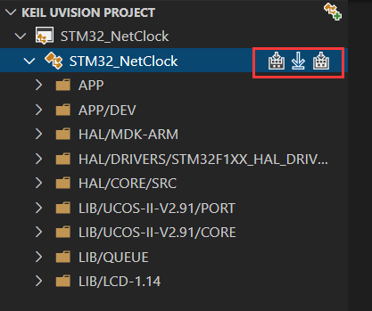
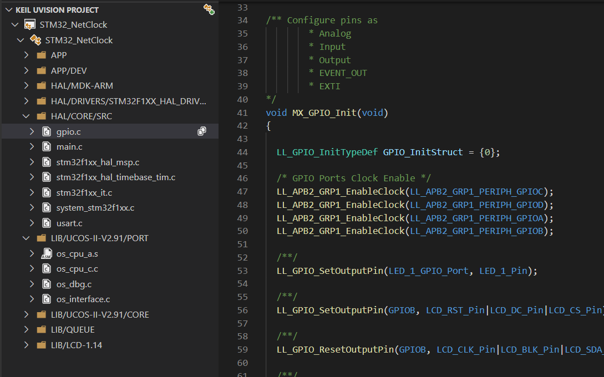
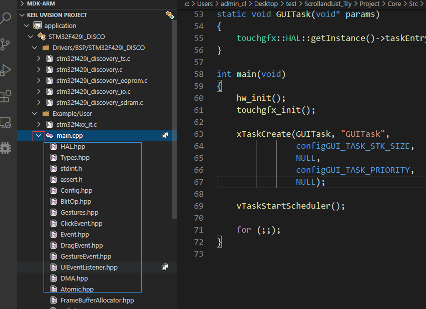

# Keil Assistant

[](https://marketplace.visualstudio.com/items?itemName=CL.keil-assistant)      [](https://marketplace.visualstudio.com/items?itemName=CL.keil-assistant)     [](https://marketplace.visualstudio.com/items?itemName=CL.keil-assistant)     [](https://marketplace.visualstudio.com/items?itemName=CL.keil-assistant)

## Summary 📑

Keil assistive tool on VScode, used with C/C++ plug-in.

It provides syntax highlighting, code snippets for Keil projects, and supports compiling and downloading Keil projects.

**Keil uVison 5 and above is supported only**  

**Windows platform only**


***

## Features 🎉

- Load the Keil C51/ARM project and display the project view as the Keil project style
- Automatically monitor keil project files for changes and keep project views up to date
- Compile, recompile, and burn Keil projects by calling the Keil command-line interface
- Automatically generate c_cpp_property.json for C/C++ plug-in

***

## Usage 📖

### Preparatory work

1. Install the C/C++ plug-in
>
2. Go to the Keil-Assistant plug-in Settings and set the absolute path of the Keil executable uv4.exe
 
 

***

### Start 🏃‍♀️

1. Create a project on Keil, add files, header path, etc
> 
2. Click **Open the Project** icon or **Use Vscode to directly open the directory where keil project file (.uvproj) is located**, and the keil project will be automatically loaded by the plug-in;
 
 

### Common operations

- **Compile and burn**：Three buttons are provided, one for compile, one for download, and one for recompile
 
 

>

- **Save and refresh**：Add/delete the source file, change and configure the project on Keil. Click **Save all** when the change is finished. The plug-in will automatically refresh the project when it detects the change of the Keil project
 
 

>

- **Open source file**：Clicking the source file will open it in preview mode, and double-clicking the source file will switch it to non-preview mode
 
 

>

- **Toggle the C/C++ plug-in configuration**：Click the target name to toggle between multiple C/C++ configurations
 
 

>

- **Switch keil Target**：Click the project toggle button to toggle between multiple Keil targets
 
 

>

- **Show reference**：After compilation is complete, you can expand the reference by clicking on the arrow icon for the source item (ARM project only)
 
 

***

### Other settings

- Workspace Settings: Project exclusion list(`KeilAssistant.Project.ExcludeList`)
 When there are multiple Keil projects in a directory, open it with the plug-in, and the plug-in loads all keil projects. This option allows you to specify which Keil projects you want to exclude, preventing the project from being automatically loaded when the workspace is opened
 **The default exclusion list**：
  ```json
  [
      "template.uvproj",
      "template.uvprojx"
  ]
  ```

### Any other questions ?

You can go to the following places to communicate

- [Discussion: https://discuss.em-ide.com/t/keil-assistant](https://discuss.em-ide.com/t/keil-assistant)

- [Github Issue: https://github.com/github0null/keil-assistant/issues](https://github.com/github0null/keil-assistant/issues)